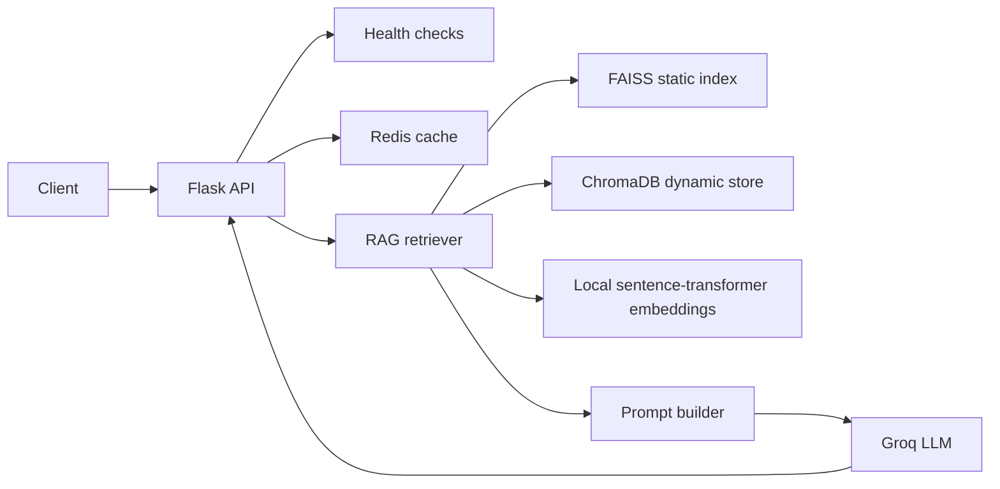

# Research Assistant RAG

A production-minded Retrieval-Augmented Generation (RAG) API for answering
research questions from a static reference corpus and user-provided documents.
The project combines Flask, LangChain, FAISS, ChromaDB, Redis, local
sentence-transformer embeddings, and Groq for answer generation.

This repository is being developed as a practical end-to-end RAG system, with
attention to deployment constraints, graceful failure, cost control, and
measurable answer quality.

## What I Have Built

### Hybrid retrieval

- **FAISS** stores the pre-built static reference corpus.
- **ChromaDB** stores documents added dynamically through the API.
- Results from both stores are combined and deduplicated before generation.
- Local Hugging Face embeddings avoid sending document text to an embedding API.

### Generation and caching

- Groq generates the final answer from retrieved context.
- Prompt construction includes retrieved context and bounded conversation
  history.
- Redis caches responses to reduce repeated LLM calls and latency.
- Redis failures do not stop the application. Cache reads and writes fail
  gracefully, and the service continues without caching.

### API surface

- `GET /health` reports application, FAISS, ChromaDB, and Redis status.
- `POST /query` retrieves context and generates an answer with sources.
- `POST /add-document` adds user-provided text to the dynamic store.

## Architecture



## Technology Stack

| Area | Technology |
| --- | --- |
| API | Flask |
| RAG orchestration | LangChain |
| Static retrieval | FAISS |
| Dynamic retrieval | ChromaDB |
| Embeddings | `sentence-transformers/all-MiniLM-L6-v2` |
| Generation | Groq API |
| Cache | Redis |
| Production server | Gunicorn with `gthread` |
| Container | Multi-stage Docker build |
| Target deployment | Render free tier with Upstash Redis |

## Milestone 1: Dockerize and Harden

The first deployment milestone is implemented.

### Docker hardening completed

- Added a multi-stage Dockerfile.
- Build dependencies are installed only in the builder stage.
- The runtime image is based on `python:3.11-slim`.
- The container runs as a non-root `appuser`.
- Python dependencies are pinned in `requirements.txt`.
- Raw PDFs are not required when the container starts.
- The pre-built FAISS index is copied into the image during the build.
- `.dockerignore` excludes Git metadata, virtual environments, caches, raw
  PDFs, `.env` files, and local test artifacts.

### Gunicorn configuration

The Flask development server has been replaced with Gunicorn. The container
uses one `gthread` worker with two threads:

```text
1 worker + 2 threads + gthread
```

This is deliberate for a 512 MB RAM / 0.1 CPU environment. Multiple worker
processes would duplicate the embedding model and increase memory pressure.
Two threads provide limited I/O concurrency while keeping the process count
and memory footprint small.

### Health endpoint

`GET /health` checks:

- Flask application responsiveness
- FAISS index availability in memory
- ChromaDB client initialization
- Redis reachability

Redis is reported as `degraded` rather than `unhealthy` when unavailable,
because caching is an optimization and the application can continue without
it. FAISS and ChromaDB are core retrieval dependencies, so failures there make
the overall health status `unhealthy`.

Example healthy response:

```json
{
  "status": "healthy",
  "service": "research-assistant-rag",
  "components": {
    "app": "healthy",
    "faiss": "healthy",
    "chroma": "healthy",
    "redis": "healthy"
  }
}
```

## Project Structure

```text
.
├── app/
│   ├── __init__.py          # Flask factory and Redis setup
│   ├── cache.py             # Graceful Redis-backed response cache
│   ├── config.py            # Environment-based configuration
│   ├── retriever.py         # FAISS + ChromaDB retrieval and Groq generation
│   └── routes.py            # Health, query, and document endpoints
├── scripts/
│   └── build_faiss_index.py # Build the static index from PDFs
├── tests/
│   └── test_routes.py       # API route tests
├── Dockerfile
├── docker-compose.yml
├── requirements.txt
└── run.py                   # Gunicorn entrypoint: run:app
```

The generated `indexes/faiss_core` directory is a build artifact and may not
be present in a fresh clone. It must exist before building the Docker image.

## Local Setup

### Prerequisites

- Python 3.11 or newer
- Docker Desktop, if running the container locally
- A Groq API key for `/query`
- Optional: Redis locally, or Docker Compose Redis
- Source PDF files for the static corpus

### 1. Create and activate a virtual environment

From the repository root:

```powershell
python -m venv .venv
.\.venv\Scripts\Activate.ps1
```

If PowerShell blocks activation for the current session:

```powershell
Set-ExecutionPolicy -Scope Process -ExecutionPolicy RemoteSigned
.\.venv\Scripts\Activate.ps1
```

### 2. Install dependencies

```powershell
python -m pip install -r requirements.txt
```

### 3. Configure environment variables

Create a local `.env` file from the example:

```powershell
Copy-Item .env.example .env
```

Set at least these values in `.env`:

```env
GROQ_API_KEY=your_real_groq_api_key
FLASK_SECRET_KEY=replace_with_a_random_secret
GROQ_MODEL=an_available_groq_model
```

The following values have useful defaults:

```env
EMBEDDING_MODEL=sentence-transformers/all-MiniLM-L6-v2
REDIS_URL=redis://localhost:6379/0
FAISS_INDEX_PATH=indexes/faiss_core
CHROMA_PERSIST_DIR=indexes/chroma_dynamic
CHROMA_COLLECTION=user_docs
MAX_HISTORY_TURNS=4
```

Never commit `.env` or place API keys in the Dockerfile, source code, or image
build context.

### 4. Add source PDFs

Create this directory and place PDFs inside it:

```text
data/raw/core_corpus/
```

### 5. Build the FAISS index

Run this command from the repository root:

```powershell
python scripts/build_faiss_index.py
```

The script loads the local embedding model, reads the PDFs, creates chunks,
generates embeddings, and writes the index to `indexes/faiss_core/`.

A successful build should contain files such as `index.faiss` and `index.pkl`.

### 6. Run the API locally

```powershell
python run.py
```

In a second terminal, test the service:

```powershell
Invoke-RestMethod http://localhost:5000/health
```

### 7. Test the API

Add a document:

```powershell
$body = @{
    document = "Redis is an in-memory data store."
    user_id = "test-user"
} | ConvertTo-Json

Invoke-RestMethod `
    -Method Post `
    -Uri http://localhost:5000/add-document `
    -ContentType "application/json" `
    -Body $body
```

Ask a question:

```powershell
$body = @{
    question = "What is Redis?"
    user_id = "test-user"
} | ConvertTo-Json

Invoke-RestMethod `
    -Method Post `
    -Uri http://localhost:5000/query `
    -ContentType "application/json" `
    -Body $body
```

## Docker Usage

The image expects the generated `indexes/faiss_core` directory in the Docker
build context. It does not rebuild the index and does not require raw PDFs at
container startup.

Start Docker Desktop, then verify the engine:

```powershell
docker version
```

Start the application and Redis:

```powershell
docker compose up --build
```

In another terminal:

```powershell
Invoke-RestMethod http://localhost:5000/health
docker compose ps
docker compose logs app
```

Stop the services with:

```powershell
docker compose down
```

## API Reference

### `GET /health`

Returns component-level readiness. The endpoint returns HTTP 200 when the
application, FAISS, and ChromaDB are healthy. Redis may be degraded without
making the endpoint unhealthy.

### `POST /query`

Request:

```json
{
  "question": "What is retrieval augmented generation?",
  "user_id": "test-user",
  "conversation_history": []
}
```

Returns the generated answer, retrieved source excerpts, and whether the
response came from Redis cache.

### `POST /add-document`

Request:

```json
{
  "document": "Text to add to the dynamic knowledge store.",
  "metadata": {"source": "manual"},
  "user_id": "test-user"
}
```

## Troubleshooting Encountered

### `ModuleNotFoundError: No module named 'app'`

Running `python scripts/build_faiss_index.py` initially failed because Python
did not automatically include the repository root when executing a script from
the `scripts` directory. The index builder was updated to add the project root
to its import path and resolve PDF paths from the project root.

### `No documents found`

The index builder cannot create an index without PDFs. Add files to
`data/raw/core_corpus/`, then run the builder again.

### Health reports FAISS as `unhealthy`

This means `indexes/faiss_core` does not exist, is not readable, or could not
be loaded. Build the index before starting the application or Docker image.

### Health reports Redis as `degraded`

Redis is unavailable. This is supported behavior: the API continues to work,
but response caching is disabled. Start local Redis or use Docker Compose Redis.

### Groq returns `model_not_found` or HTTP 404

The configured model is unavailable or the account does not have access to it.
Set `GROQ_MODEL` to a currently available model for the Groq account, restart
the application, and retry `/query`. The API key must also be valid.

### Docker cannot connect to the engine

If Docker reports that the Linux engine or named pipe is unavailable, start
Docker Desktop and wait until it finishes initializing. Confirm with:

```powershell
docker version
```

The command must show both client and server information.

### Docker build cannot find `indexes`

The generated FAISS index is intentionally required at build time. Run the
index builder successfully first, then run `docker compose up --build`.

## Validation So Far

The route test suite currently passes:

```text
5 passed
```

The tests cover health responses and validation for missing or empty query and
document payloads. Full end-to-end validation still requires a generated FAISS
index, a running application, a valid Groq model/API key, and optionally Redis.

## Roadmap

The following plan is the next development sequence. Each stage builds on the
previous one and keeps the system deployable while functionality grows.

### 1. Dockerize and harden — completed

- Multi-stage Docker build and pinned dependencies.
- Non-root runtime image.
- Gunicorn instead of the Flask development server.
- One `gthread` worker with a small thread pool for the Render free tier.
- Real component-level `/health` endpoint.
- `.dockerignore` for secrets, raw PDFs, Git files, caches, and test artifacts.
- Decision: bake the pre-built FAISS index into the image rather than rebuilding
  from PDFs or requiring the raw corpus at container startup.

### 2. Deploy the skeleton — next

- Deploy a Render free web service.
- Provision Upstash Redis.
- Configure runtime environment variables securely.
- Get `/health` working in production.
- Get `/query` working end-to-end in production before adding more features.

This production skeleton becomes the safety net for the rest of the sprint.

### 3. Add authentication, rate limiting, and logging

- Add API-key authentication to `/query` and `/add-document`.
- Replace global-only limits with per-key rate limits.
- Add structured JSON logs.
- Capture request latency, cache hit/miss, token usage in, and token usage out.
- Ensure secrets and user content are not accidentally logged.

### 4. Add reranking

Add a cross-encoder reranker after initial FAISS/Chroma retrieval. The reranker
will score candidate chunks and pass only the strongest results to the prompt
builder. This is expected to be the highest-impact answer-quality improvement
for the implementation effort.

### 5. Build an evaluation harness

- Assemble a small labeled Q&A set from the corpus.
- Add RAGAS or a lightweight custom scorer.
- Measure faithfulness and relevance.
- Record a baseline before reranking.
- Use the baseline to measure whether later changes improve answer quality.

### 6. Wire up CI/CD

Create a GitHub Actions pipeline that runs:

```text
lint -> unit tests -> image build -> evaluation harness -> deploy
```

The evaluation harness should act as a quality gate before deployment to the
main environment.

### 7. Fix persistence and polish the project

- Address the ChromaDB ephemeral-disk limitation on Render.
- Document the limitation clearly or migrate dynamic storage to a suitable
  persistent service such as Chroma Cloud's free tier.
- Add the final architecture diagram and deployment notes.
- Document the major trade-offs for technical discussions and interviews.

## Design Trade-offs

### Local embeddings instead of hosted embeddings

Local embeddings avoid an additional API dependency and embedding cost, but
they increase image size, startup time, and memory usage.

### FAISS baked into the image

Baking the static index makes startup predictable and avoids shipping raw PDFs
or performing an expensive rebuild in a small container. The trade-off is that
the image must be rebuilt whenever the static corpus changes.

### ChromaDB for dynamic documents

ChromaDB keeps the first implementation simple and supports incremental user
documents. The trade-off is that a free web instance with ephemeral storage
cannot be treated as durable persistence, which is addressed in roadmap item 7.

### Redis as an optional cache

Redis improves cost and latency, but it is not required for correctness. The
application therefore treats Redis failure as degradation instead of a total
service outage.

### One Gunicorn worker

The free-tier memory limit makes process duplication expensive, especially with
local embedding models. One worker with a small thread pool is a deliberate
resource constraint rather than a general-purpose production default.

## License

MIT
